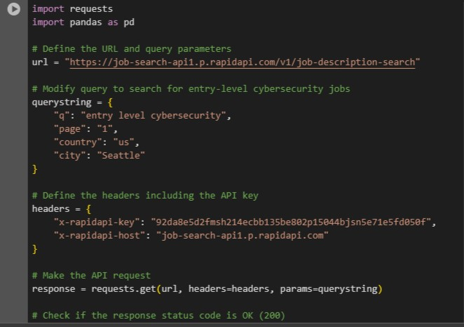

# Entry-Level Cybersecurity Jobs Scraper
## Table of Contents
- [Project Description](#project-description)
- [Installation](#installation)
- [Usage](#usage)
- [Customization](#customization)
- [License](#license)
- [Contributing](#contributing)
- [Credits](#credits)
- [Frequently Asked Questions (FAQ)](#frequently-asked-questions-faq)


# Project Description
This project is designed to scrape entry-level cybersecurity job listings from an external job search API and save the data into a CSV file. The script sends a request to the API, retrieves job data specific to entry-level cybersecurity positions in Seattle, and processes the data into a structured format using pandas. This tool is useful for data analysts, job seekers, and researchers looking for insights into the entry-level job market in the cybersecurity field.


# Installation
To run this project, you'll need Python installed on your system along with the required libraries. Follow the steps below to get started:

# Clone the repository (if applicable):

<!-- python code block -->
```python
git clone https://github.com/yourusername/entry-level-cybersecurity-jobs-scraper.git
cd entry-level-cybersecurity-jobs-scraper
```

Install the required Python packages: Make sure you have Python installed. You can install the required packages using pip:

<!-- python code block -->
```python
pip install requests pandas
```
Set up your API Key: Replace the placeholder API key in the script (x-rapidapi-key) with your actual key from RapidAPI.

# Usage
To run the script and retrieve the job data, execute the following command:

<!-- python code block -->
```python
python job_scraper.py
```
The script will fetch entry-level cybersecurity job listings for Seattle, process the data, and save it to a CSV file named entry_level_cybersecurity_jobs.csv in the current directory.



# Customization
You can customize the query parameters in the script to change the job search criteria:


q: The search query. Currently set to "entry level cybersecurity".

Expand the search to include cybersecurity internships

q: 'cybersecurity internship'

page: The page number of the search results.

Country: The country filter, currently set to the US.

City: The city filter, currently set to Seattle.

Change to search for jobs in New York City

City: 'New York'

Modify these parameters as needed to suit your requirements.

# License
This project is licensed under the MIT License. See the LICENSE file for details.

# Contributing
Contributions are welcome! Please open an issue or submit a pull request if you have suggestions or improvements.

# Fork the repository.
Create your feature branch (git checkout -b feature/AmazingFeature).
Commit your changes (git commit -m 'Add some AmazingFeature').
Push to the branch (git push origin feature/AmazingFeature).
Open a pull request.
# Credits
Developer: Your Name (youremail@example.com)
This project uses data from the Job Search API available on RapidAPI.

## Frequently Asked Questions (FAQ)
1. How do I get a RapidAPI key?

   To acquire an API key is as simple as going to a website, for example www.rapidapi.com, select an API of choice. Set the necessary settings needed and test the API to make sure it's functional, once it's functional then proceed to coping the code and place it into your IDE (Integrated Development Enviroment) and run it.

2. What happens if I exceed my API quota?

   Exceeding your API quota will return a "Failed to retrieve data: 429" error. A few solutions for this error are implement request throttling which is to limit the number of requests you send to the server over a given period. For example, pause for a few seconds between each request. Use API Key Rotation if allowed, if the API permits, rotate between multiple API keys to distribute the load. Contact Support, if you're consistently hitting rate limits, consider reaching out to the API provider for support or to request higher limits.

3. How do I report bugs or suggest features?

   You can submit issues via the GitHub issues page.

4. What if I encounter an error during installation?

   Check the troubleshooting section for common issues and fixes. If you're still stuck, feel free to raise an issue on GitHub.

5. How can I contribute?

   We welcome contributions! Please check out our Contribution Guidelines.
